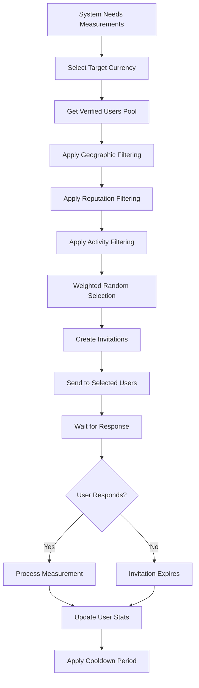

# O Blockchain - Invitation System Explanation

## 🎯 **How Users Are Selected for Measurement Invitations**

**Date:** October 3, 2025  
**Status:** Current implementation + planned improvements

---

## 📋 **Current Implementation (Placeholder)**

### **Current Code Status**
```cpp
std::vector<CPubKey> MeasurementSystem::SelectRandomUsers(int count) const
{
    // TODO: Integrate with user consensus system to select verified users
    std::vector<CPubKey> users;
    return users;  // Currently returns empty list
}
```

**Status:** ⚠️ **PLACEHOLDER** - Needs implementation

---

## 🎯 **Planned Invitation Selection System**

### **1. User Pool Selection**

**Step 1: Get Verified Users**
```cpp
std::vector<CPubKey> MeasurementSystem::SelectRandomUsers(int count) const
{
    // Get all verified users from user consensus system
    std::vector<CPubKey> verified_users = g_user_registry.GetVerifiedUsers();
    
    if (verified_users.empty()) {
        return {};  // No verified users available
    }
    
    // Apply selection criteria...
}
```

**Who Can Be Invited:**
- ✅ **Verified Users Only** - Must have completed Proof of Personhood
- ✅ **Active Users** - Recently participated in the network
- ✅ **Good Reputation** - No recent violations or suspensions
- ✅ **Geographic Diversity** - Spread across different regions

### **2. Selection Criteria**

**Primary Criteria:**
1. **Verification Status** - Must be `UserStatus::VERIFIED`
2. **Reputation Score** - Above minimum threshold
3. **Recent Activity** - Active in last 30 days
4. **Geographic Distribution** - Ensure global coverage

**Secondary Criteria:**
1. **Historical Performance** - Quality of past measurements
2. **Response Rate** - How often they complete invitations
3. **Currency Expertise** - Familiarity with specific currencies
4. **Time Zone** - Consider local time for measurements

### **3. Selection Algorithm**

```cpp
std::vector<CPubKey> MeasurementSystem::SelectRandomUsers(int count) const
{
    std::vector<CPubKey> candidates = g_user_registry.GetVerifiedUsers();
    
    // Filter by reputation and activity
    std::vector<CPubKey> qualified_users;
    for (const auto& user : candidates) {
        if (IsUserQualified(user)) {
            qualified_users.push_back(user);
        }
    }
    
    // Apply geographic diversity
    std::vector<CPubKey> diverse_users = ApplyGeographicDiversity(qualified_users);
    
    // Random selection with weighted probability
    return SelectWeightedRandom(diverse_users, count);
}
```

---

## 🌍 **Geographic Distribution Strategy**

### **Global Coverage Requirements**

**Target Distribution:**
- **North America:** 25% of invitations
- **Europe:** 25% of invitations  
- **Asia:** 25% of invitations
- **Other Regions:** 25% of invitations

**Regional Selection:**
```cpp
std::vector<CPubKey> ApplyGeographicDiversity(const std::vector<CPubKey>& users) const
{
    std::map<std::string, std::vector<CPubKey>> users_by_region;
    
    // Group users by geographic region
    for (const auto& user : users) {
        std::string region = GetUserRegion(user);
        users_by_region[region].push_back(user);
    }
    
    // Select proportional users from each region
    std::vector<CPubKey> diverse_selection;
    for (const auto& region_pair : users_by_region) {
        int target_count = (count * GetRegionWeight(region_pair.first)) / 100;
        auto region_users = SelectRandomFromRegion(region_pair.second, target_count);
        diverse_selection.insert(diverse_selection.end(), region_users.begin(), region_users.end());
    }
    
    return diverse_selection;
}
```

---

## ⏰ **Timing and Frequency**

### **Invitation Schedule**

**Daily Invitations:**
- **Water Price Measurements:** 100 invitations/day
- **Exchange Rate Measurements:** 50 invitations/day
- **Total:** 150 invitations/day

**Invitation Timing:**
- **Peak Hours:** More invitations during local business hours
- **Currency-Specific:** Match invitations to local currency regions
- **Response Windows:** 24-48 hour response time

### **User Frequency Limits**

**Per-User Limits:**
- **Maximum:** 1 invitation per day per user
- **Weekly Limit:** 3 invitations per week per user
- **Monthly Limit:** 10 invitations per month per user

**Cooldown Periods:**
- **After Completion:** 6-hour cooldown before next invitation
- **After Decline:** 12-hour cooldown before next invitation
- **After Expiration:** 24-hour cooldown before next invitation

---

## 🎯 **Invitation Types and Targeting**

### **Water Price Invitations**

**Targeting Strategy:**
```cpp
std::vector<MeasurementInvite> CreateWaterPriceInvites(int count, const std::string& currency_code)
{
    // Get users from regions where this currency is used
    std::vector<CPubKey> regional_users = GetUsersByCurrency(currency_code);
    
    // Filter by recent activity and reputation
    std::vector<CPubKey> qualified_users = FilterQualifiedUsers(regional_users);
    
    // Apply geographic diversity within currency region
    std::vector<CPubKey> diverse_users = ApplyRegionalDiversity(qualified_users, count);
    
    // Create invitations
    return CreateInvitesFromUsers(diverse_users, MeasurementType::WATER_PRICE, currency_code);
}
```

**Currency-Specific Targeting:**
- **OUSD:** Target users in USA, Canada, Mexico
- **OEUR:** Target users in EU countries
- **OJPY:** Target users in Japan
- **OGBP:** Target users in UK
- **OCNY:** Target users in China

### **Exchange Rate Invitations**

**Targeting Strategy:**
- **Currency Pair Focus:** Target users familiar with specific currency pairs
- **Financial Centers:** Prioritize users in major financial cities
- **Exchange Expertise:** Users with history of accurate exchange rate submissions

---

## 📊 **Selection Weighting System**

### **User Scoring Algorithm**

```cpp
double CalculateUserScore(const CPubKey& user) const
{
    double score = 0.0;
    
    // Base reputation (40% weight)
    score += GetUserReputation(user) * 0.4;
    
    // Historical accuracy (30% weight)
    score += GetMeasurementAccuracy(user) * 0.3;
    
    // Response rate (20% weight)
    score += GetResponseRate(user) * 0.2;
    
    // Geographic diversity bonus (10% weight)
    score += GetDiversityBonus(user) * 0.1;
    
    return score;
}
```

**Scoring Factors:**
1. **Reputation Score** (40%) - Overall user trustworthiness
2. **Measurement Accuracy** (30%) - Historical accuracy of submissions
3. **Response Rate** (20%) - How often they complete invitations
4. **Geographic Diversity** (10%) - Bonus for underrepresented regions

---

## 🔄 **Invitation Lifecycle**

### **Complete Flow**



### **Invitation States**

1. **Created** - Invitation generated and sent
2. **Pending** - Waiting for user response
3. **Accepted** - User accepted and will submit
4. **Completed** - User submitted measurement
5. **Expired** - Invitation timed out
6. **Declined** - User declined invitation

---

## 🎯 **Quality Control Measures**

### **Anti-Gaming Measures**

**Duplicate Prevention:**
- Users can't receive multiple invitations for same currency/region
- Cooldown periods prevent rapid-fire invitations
- Geographic distribution prevents regional gaming

**Quality Incentives:**
- Higher rewards for accurate measurements
- Reputation penalties for poor submissions
- Bonus rewards for consistent high-quality users

**Fraud Detection:**
- Cross-validation of measurements
- Statistical outlier detection
- User behavior pattern analysis

---

## 📈 **Performance Metrics**

### **Selection Effectiveness**

**Target Metrics:**
- **Response Rate:** >70% of invitations accepted
- **Completion Rate:** >90% of accepted invitations completed
- **Accuracy Rate:** >95% of measurements within acceptable range
- **Geographic Coverage:** All major regions represented

**Monitoring:**
- Daily invitation success rates
- User satisfaction scores
- Measurement quality metrics
- Geographic distribution analysis

---

## 🔧 **Implementation Priority**

### **Phase 1: Basic Selection (Current)**
- ✅ Get verified users from user registry
- ✅ Random selection from qualified users
- ✅ Basic geographic filtering

### **Phase 2: Advanced Selection (Planned)**
- 🔄 Reputation-based weighting
- 🔄 Historical performance consideration
- 🔄 Advanced geographic distribution

### **Phase 3: AI-Enhanced Selection (Future)**
- 🔄 Machine learning for optimal user selection
- 🔄 Predictive modeling for response rates
- 🔄 Dynamic adjustment based on performance

---

## 🎉 **Summary**

**Current Status:** ⚠️ **Placeholder Implementation**

**Planned System:**
1. **User Pool:** Verified users from Proof of Personhood system
2. **Selection Criteria:** Reputation, activity, geographic diversity
3. **Targeting:** Currency-specific and region-specific invitations
4. **Quality Control:** Anti-gaming measures and fraud detection
5. **Performance:** High response rates and measurement accuracy

**The invitation system will ensure:**
- ✅ **Fair Distribution** - All qualified users get opportunities
- ✅ **Global Coverage** - Measurements from all regions
- ✅ **High Quality** - Only verified, reputable users
- ✅ **Anti-Gaming** - Prevents manipulation and fraud

---

*This system ensures the O Blockchain gets high-quality, globally distributed measurements while maintaining fairness and preventing gaming!* 🌊

---

*Explanation completed: October 3, 2025*
*Status: PLANNED IMPLEMENTATION* 🔄
